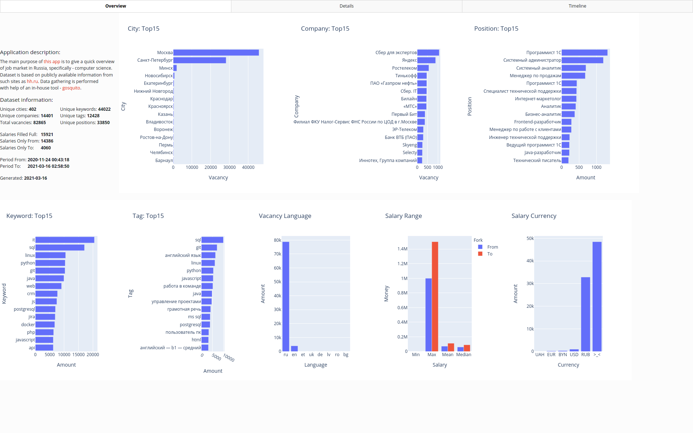

# lazy-crow-nest


***lazy-crow-nest*** ("lazy" + "[crow's nest](https://en.wikipedia.org/wiki/Crow%27s_nest)") is a [Dash](https://github.com/plotly/dash) app for a quick overview
of job market in Russia.

### Features:

* 24/7 new data fetching.
* Regular [Spark](https://spark.apache.org/) task for clean, extract, enrich data etc. Weekly [Docker image](https://github.com/livelace/lazy-crow-nest/pkgs/container/lazy-crow-nest).
* Different datasets (*common:* all positions, *it:* information technologies positions).
* Different metrics: city, title, company, salary etc.
* Filtering by different parameters.

### Datasets:

* common-year.pickle
* common-six-months.pickle
* common-three-months.pickle
* it-year.pickle
* it-six-months.pickle
* it-three-months.pickle

### Dash:



### Quick start:

```shell script
# start app and navigate to web ui.
user@localhost / $ docker run -ti --rm "ghcr.io/livelace/lazy-crow-nest"
user@localhost / $ docker run -e "LCN_DATA_PATH=/data/common-year.pickle" -ti --rm "ghcr.io/livelace/lazy-crow-nest"
user@localhost / $ docker run -e "LCN_DATA_PATH=/data/it-year.pickle" -ti --rm "ghcr.io/livelace/lazy-crow-nest"
Dash is running on http://0.0.0.0:8050/

 * Serving Flask app "lcn.__main__" (lazy loading)
 * Environment: production
   WARNING: This is a development server. Do not use it in a production deployment.
   Use a production WSGI server instead.
 * Debug mode: off
 * Running on http://0.0.0.0:8050/ (Press CTRL+C to quit)
```
